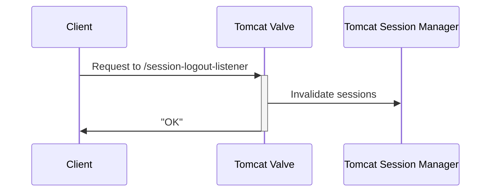

# Tomcat Session Logout Listener

[](https://github.com/smarkwal/tomcat-session-logout-listener/releases/latest)
[](https://github.com/smarkwal/tomcat-session-logout-listener/blob/main/LICENSE)
[](https://github.com/smarkwal/tomcat-session-logout-listener/issues)

[](https://github.com/smarkwal/tomcat-session-logout-listener/actions/workflows/build.yml)
[](https://sonarcloud.io/component_measures?id=smarkwal_tomcat-session-logout-listener&metric=test_success_density&selected=smarkwal_tomcat-session-logout-listener%3Asrc%2Ftest%2Fjava%2Forg%2Fsession-logout-listener)
[](https://sonarcloud.io/component_measures?id=smarkwal_tomcat-session-logout-listener&metric=coverage&view=list)
[](https://sonarcloud.io/dashboard?id=smarkwal_tomcat-session-logout-listener)

Tomcat valve for remote session invalidation.

### Situation

A web application is hosted on [Apache Tomcat](https://tomcat.apache.org/).
Tomcat is configured to use an external user management system (e.g., LDAP) for authentication.
Upon successful authentication, Tomcat creates a session and stores the user's identity (principal) in that session.
The ID of the session is stored in a cookie on the user's browser.

For performance reasons, Tomcat usually does not re-validate the user's identity on every request.
This would require an expensive round-trip to the user management system.
Instead, Tomcat fully relies on the data in the session to authorize access to protected resources.

### Problem

If the user's password is changed, if the user is removed from some security roles, or if the user's account is disabled or deleted,
an already logged-in user can continue to work with the web application as if nothing has happened.
This can be a security problem.

It would be nice if the external user management system could notify Tomcat that the user's identity has changed.
Then, Tomcat could invalidate that user's session and force the user to log in again.

### Solution

This project provides a Tomcat valve that implements a web hook for remote session invalidation.
An external user management system (or an intermediate component) can call the web hook to invalidate a session.

This valve waits for HTTP requests sent to the endpoint `/session-logout-listener`.
When such a request is received, it is intercepted and processed by the valve.
The valve looks for a parameter with name `username`.
If the parameter is present, the valve iterates over all active Tomcat sessions and
invalidate all sessions with a principal name matching that parameter value.



### Note

This project does not provide a solution for how to invoke the web hook.

Please consult the documentation of your user management system for how to be notified of changes to user identities.
Maybe it offers this functionality out of the box, maybe you have to implement some kind of plugin,
or maybe you have to write a custom component that periodically polls the user management system for changes.

## Requirements and compatibility

This valve has been tested with the following software components:

* Tomcat 7.0.109, Tomcat 8.5.88, and Tomcat 9.0.75.
* Java 8, Java 11, and Java 17.

Note: The valve is not compatible with Tomcat 10.0.0 or newer.

# Download

The latest release is available on [GitHub](https://github.com/smarkwal/tomcat-session-logout-listener/releases)
and [Maven Central](https://mvnrepository.com/artifact/net.markwalder/tomcat-session-logout-listener).

# Installation and configuration

Copy `tomcat-session-logout-listener-<version>.jar` to `$TOMCAT_HOME/lib/`.

Add the following line to `$TOMCAT_HOME/conf/server.xml` or `$TOMCAT_HOME/conf/context.xml`:

```xml
<Valve className="net.markwalder.tomcat.SessionLogoutListener"/>
```

The valve supports the following configuration attributes:

| Attribute  | Default value   | Description                                                                                                                                              |
|------------|-----------------|----------------------------------------------------------------------------------------------------------------------------------------------------------|
| `ipFilter` | `127.0.0.1,::1` | Comma-separated list of client IPv4 or IPv6 addresses and subnets that are allowed to call the web hook. The special value `*` matches all IP addresses. |
| `password` | (not set)       | Password required to call the web hook. Must be submitted as request parameter `password`.                                                              |

Example configuration:

```xml
<Valve className="net.markwalder.tomcat.SessionLogoutListener" 
       ipFilter="127.0.0.1,10.0.0.0/24,::1,fc00::/7" 
       password="my-secret-123!"
/>
```

Typical IP subnets for local and private address ranges:

* `127.0.0.0/8`
* `10.0.0.0/8`
* `172.16.0.0/12`
* `192.168.0.0/16`
* `fc00::/7`
* `fe80::/10`

### Logging

Add the following lines to `$TOMCAT_HOME/conf/logging.properties`:

```properties
# Enable debug logging for Tomcat Session Logout Listener
net.markwalder.tomcat.SessionLogoutListener.level = FINE
```

When a request is sent to the session logout endpoint, the following log messages are written:

```
FINE [http-nio-8080-exec-1] net.markwalder.tomcat.SessionLogoutListener.logoutUsers usernames: 'alice', 'bob'
FINE [http-nio-8080-exec-1] net.markwalder.tomcat.SessionLogoutListener.logoutUsers session: id='78F9279D...', principal='alice'
FINE [http-nio-8080-exec-1] net.markwalder.tomcat.SessionLogoutListener.logoutUsers session: id='1EF34298...', principal='bob'
```

For security reasons, only the first 8 characters of the session ID are logged.

# Integration

Send an HTTP request to the session logout endpoint with a parameter `username` set to the username of the user to be logged out.
You can use any HTTP client like `curl` or `wget`, or third-party HTTP or REST client libraries in your favorite programming language.

Example `GET` request:

```
GET /session-logout-listener?username=alice HTTP/1.1
```

Example `POST` request:

```
POST /session-logout-listener HTTP/1.1
Content-Type: application/x-www-form-urlencoded
Content-Length: 14

username=alice
```

This request will invalidate all sessions of user "alice".

It is possible to log out multiple users at once by specifying the parameter `username` multiple times.

Example `GET` request:

```
GET /session-logout-listener?username=alice&username=bob HTTP/1.1
```

Example `POST` request:

```
POST /session-logout-listener HTTP/1.1
Content-Type: application/x-www-form-urlencoded
Content-Length: 27

username=alice&username=bob
```

Note that if your web application is deployed in a context path other than `/`, you must include the context path in the request URL.

### Successful response

The session logout endpoint will return an HTTP response with status code 200 (OK), content type "text/plain", character set "UTF-8", and the text "OK" as body:

```
HTTP/1.1 200 OK
Content-Type: text/plain;charset=UTF-8
Content-Length: 2

OK
```

### Error response

If the client's IP address or password is not accepted by the valve, an HTTP response with status code 403 (Forbidden) and the text "Forbidden" is returned:

```
HTTP/1.1 403 Forbidden
Content-Type: text/plain;charset=UTF-8
Content-Length: 8

Forbidden
```

More details can be found in Tomcat's log file.

Example log messages:

```
WARN [http-nio-8080-exec-1] net.markwalder.tomcat.RemoteAddrCheck.test Remote address '123.45.67.89' does not match IP filter.
WARN [http-nio-8080-exec-1] net.markwalder.tomcat.PasswordCheck.test No password found in request.
WARN [http-nio-8080-exec-1] net.markwalder.tomcat.PasswordCheck.test Incorrect password.
```

### Clusters

If Tomcat is running in a cluster, the session logout endpoint must be called on all cluster nodes.

### Security considerations

The session logout endpoint can be protected by client IP address filtering and/or a password.
If you have additional security requirements, feel free to fork this project and implement your own security mechanism.

To prevent parameters from being logged as part of the URL, it is recommended to use `POST` requests instead of `GET` requests.

To prevent session IDs from leaking, only the first 8 characters of the session ID are logged.
But since these sessions have been invalidated, this should not be a security problem anyway.

# License

This project is licensed under the [MIT license](https://github.com/smarkwal/tomcat-session-logout-listener/blob/main/LICENSE).

# Build from source code

To build this project from source code, execute the following command:

```shell
# set JAVA_HOME to a JDK 11
export JAVA_HOME=/path/to/java-11

# build JAR file
./gradlew clean jar
```

The JAR file `tomcat-session-logout-listener-<version>.jar` can be found in `build/libs`.

### Run tests

Integration tests use [JUnit 5](https://junit.org/junit5/), [Testcontainers](https://www.testcontainers.org/), and [Docker](https://www.docker.com/) to run different Tomcat versions in containers.
Docker therefore must be installed on the build machine.

To run all tests, execute the following command:

```shell
./gradlew clean test
```

The test report can be found under `build/reports/tests/test/index.html`.
